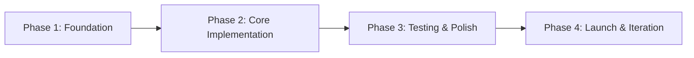

# Project Roadmap

> **Synthesised from source documents.** This roadmap breaks the project into phases, each with clear deliverables and exit criteria. Phase documents live in `docs/planning/`.

---

## Vision

<!-- One paragraph: what is the end state of this project? What does success look like? -->

---

## Phases at a Glance

| Phase | Objective | Duration (est.) | Status |
|-------|-----------|-----------------|--------|
| 1 | Foundation — domain models, core data pipeline, dev environment | 1–2 weeks | 🟡 Planned |
| 2 | Core Implementation — business logic, API/services, integration | 2–4 weeks | 🟡 Planned |
| 3 | Testing & Polish — test suite, edge cases, performance, docs | 1–2 weeks | 🟡 Planned |
| 4 | Launch & Iteration — deployment, monitoring, feedback loop | Ongoing | 🟡 Planned |

---

## Dependency Map

- Phase 2 cannot start until Phase 1 deliverables are accepted
- Phase 3 runs in parallel with the tail end of Phase 2 (test as you build)
- Phase 4 begins when Phase 3 exit criteria are met

---

## Key Milestones

| Milestone | Phase | Description |
|-----------|-------|-------------|
| M1 | 1 | Core data models defined and validated |
| M2 | 1 | Data pipeline ingests and processes real/sample data |
| M3 | 2 | Primary service logic implemented and wired |
| M4 | 2 | API / interface complete and callable |
| M5 | 3 | Test suite passes with ≥80% coverage |
| M6 | 3 | Performance benchmarks meet targets |
| M7 | 4 | Deployed to production / staging |
| M8 | 4 | Monitoring and alerting active |

---

## Risk Notes

| Risk | Impact | Likelihood | Mitigation |
|------|--------|------------|------------|
| ... | High | Medium | ... |
| ... | Medium | Low | ... |

---

## Open Questions

<!-- Questions that arose from source documents but are not yet resolved -->

- ...

---

*Last updated: YYYY-MM-DD*
